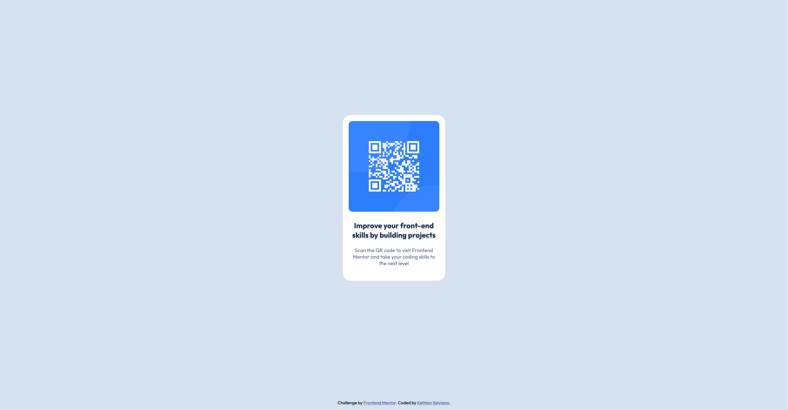

# Frontend Mentor - QR code component solution

This is a solution to the [QR code component challenge on Frontend Mentor](https://www.frontendmentor.io/challenges/qr-code-component-iux_sIO_H). Frontend Mentor challenges help you improve your coding skills by building realistic projects. 

## Table of contents

- [Overview](#overview)
  - [Screenshot](#screenshot)
  - [Links](#links)
- [My process](#my-process)
  - [Built with](#built-with)
  - [Useful resources](#useful-resources)
- [Author](#author)
- [Acknowledgments](#acknowledgments)

## Overview

### Screenshot

### Links

- Solution URL: [Add solution URL here](https://github.com/kethlensalviano/kethlensalviano.github.io/tree/main/docs/qr-code-component-main)
- Live Site URL: [Add live site URL here](https://kethlensalviano.github.io/qr-code-component-main/)

## My process

### Built with

- Semantic HTML5 markup
- CSS custom properties
- Flexbox

### Useful resources

- [W3 Schools HTML Layout](https://www.w3schools.com/html/html_layout.asp) - Refresher on HTML layout elements.
- [CSS Flexbox Layout Guide](https://css-tricks.com/snippets/css/a-guide-to-flexbox/) - A great guide to Flexbox layout.

## Author

- Website - [Kethlen Salviano](https://kethlensalviano.github.io)
- Frontend Mentor - [@kethlensalviano](https://www.frontendmentor.io/profile/kethlensalviano)

